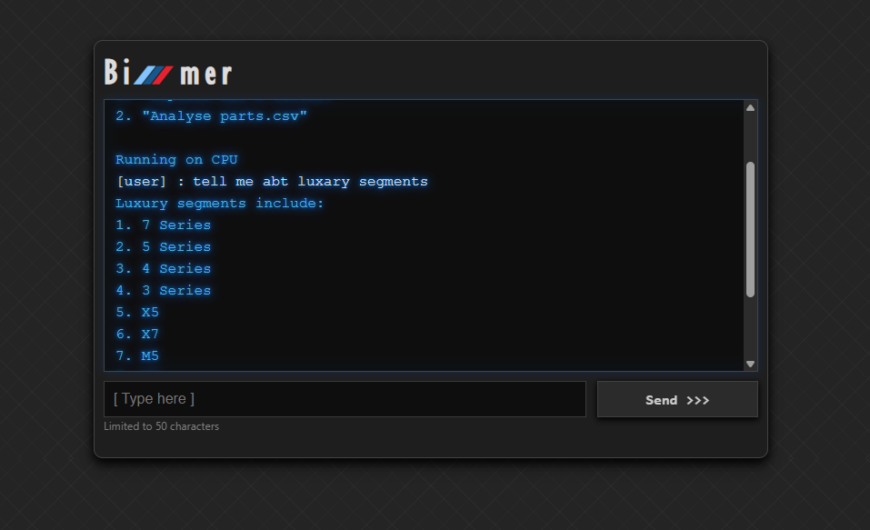
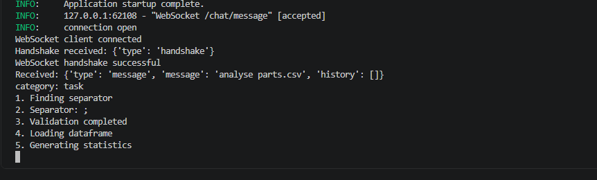
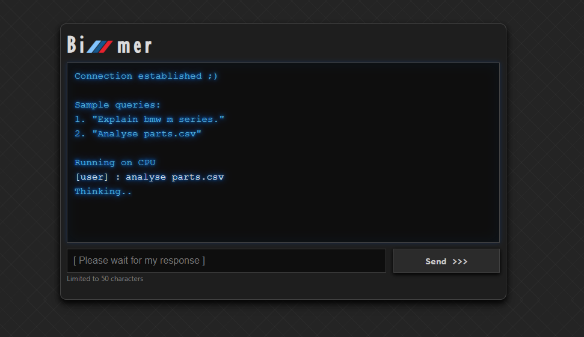
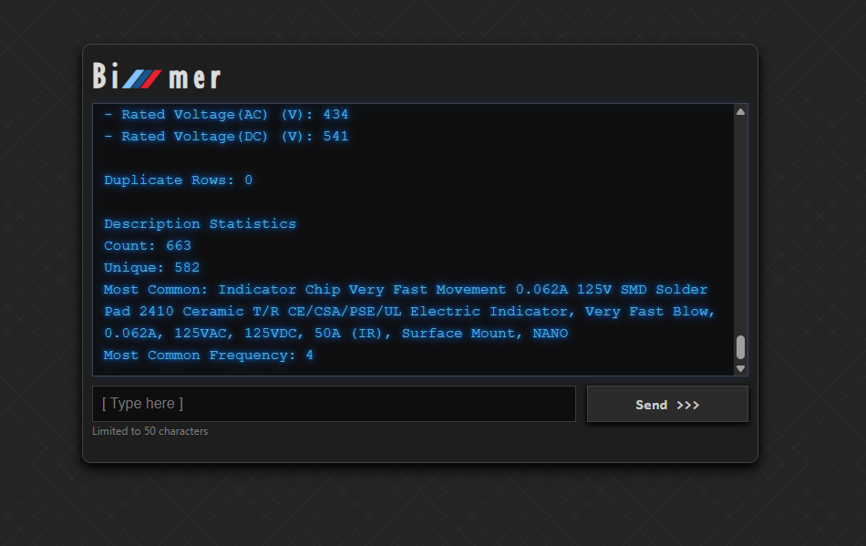

Requirement:
 - Node: v22.15.0
 - uv
 - python 3.13

Used Techs:
 - vite + react.js
 - sockets
 - fastapi
 - uv
 - huggingface
 - pandas (task 3)

Commands to run:
 - Backend: `uv run uvicorn main:app --app-dir src --reload`
 - Frontend:
    1. `npm install`
    2. `npm run dev`

Commands to run directly on Docker environment:
 - `docker build -t bimmer-bot .`
 - `docker run --rm -p 8000:8000 -p 5173:5173 -v ${home}/.cache/huggingface:/root/.cache/huggingface bimmer-bot`
 - Note: I mounted my hf cache path to reduce the start time. You can update the `.env` with your cached model and mount your volume to quickly start the app.

 Frontend URL: http://localhost:5173
 Backend URL: http://localhost:8000

Refer screenshots folder:

 TASK 1:
  - I have used small scale model to work effectively on my CPU.
  - Code will automatically detect GPU using torch package and LLM model will be powered by GPU.
  - Created frontend and backend service to give complete experience of the chatbot.
  - I simulated agentic approach by using LLM as query classifier.
  - When user asks query related to BMW or cars it will classify them and redirect to chat bot, if query is related to task 3 that analysing Parts.csv then it will classify it as "task" and call the service to analyse and summarize the Parts.csv

TASK 3: 
 - I have integrated task 3 as a service in the chat bot which will automatically classify user query and redirect to right agent.
 - For quick reference visit `others` folder.
 - I used LLM to analyze and find the separator with sample data.
 - Validated dataset using the LLM provided separator to agree with the separator.
 - Used `pandas` dataframe for understanding description column.
 - I didn't proceed further as it requires more to ML knowledge. 

KNOWN ISSUES & IMPROVEMENTS:
 - Running on docker giving response as full string instead of streaming word by word.
 - Socket connection can be handled in a better way.
 - TASK 3 reponse can be fed to chat bot to give its opinion.
 - Chat history is not implemented fully.
